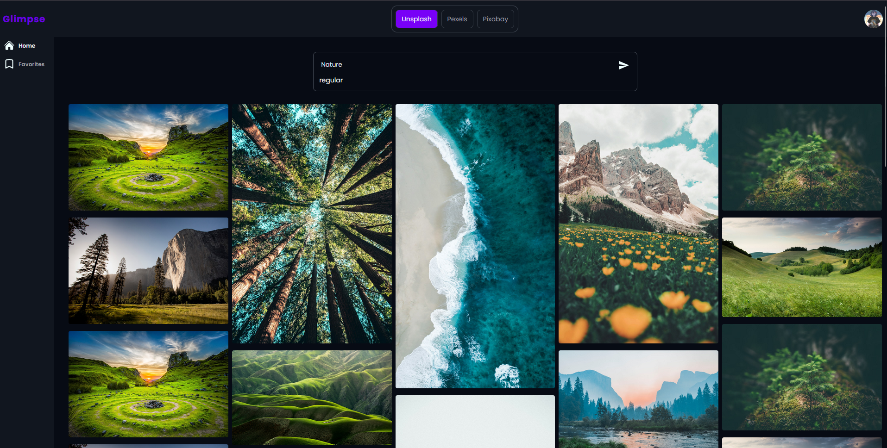
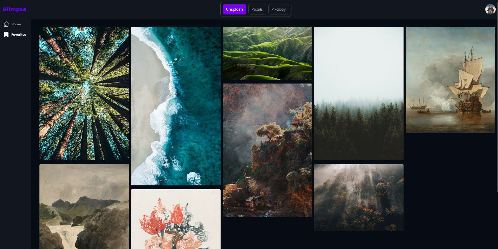

# Glimpse

**[Live demo](https://glimpse-dun-seven.vercel.app)**

Glimpse is a small image search app that lets you search **multiple photo APIs from a single place**.
Pick a provider, type a keyword, and browse results.

## Features

- Keyword search
- Provider selection: **Unsplash** / **Pexels** / **Pixabay**
- Masonry-style grid layout
- Basic loading state + basic toast notifications
- Image preview modal
- Download image from modal
- User Account (signup/login)
- Password reset via email
- Infinite scroll

## Screenshots




## Setup

### Install & Run

```bash
npm i
npm run dev      For Vite
npm run server   For Backend
```

## Environment Variables

Copy the example file and fill in your keys:

```bash
cp .env.example .env
```

Then edit `.env` and add your API keys.

## Roadmap

- [✓] Image quality selector (thumbnail / HD / Full HD / 4K / original)
- [✓] Infinite scroll (Pinterest-style)
- [✓] Better error states (network / rate limit / empty)
- [✓] Responsive UI improvements
- [✓] More providers (Pixabay, etc.)
- [✓] User accounts
- [✓] Favorites

## Tech Stack

**Frontend**  
React (Vite) • CSS3 • Axios • react-router-dom • react-masonry-css 

**APIs**  
Unsplash • Pexels • Pixabay

**Backend**
Node • express • bcryptjs • jwt • mongoDB • multer • Cloudinary • Resend
